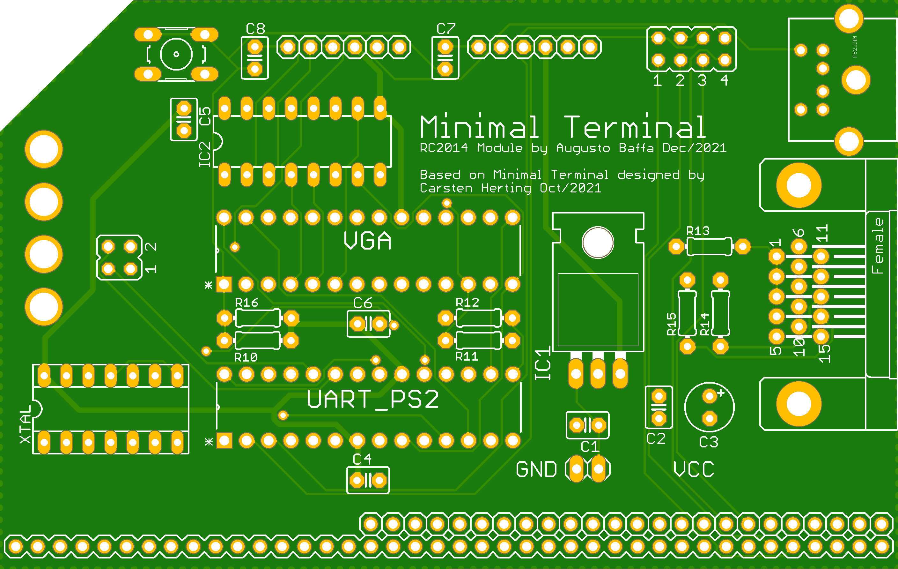
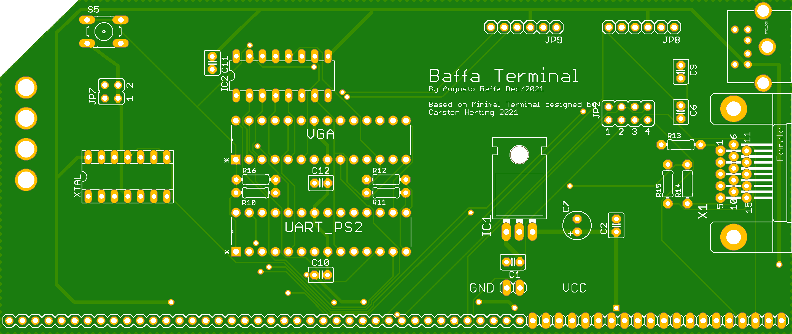

# Baffa Terminal (minimal-terminal clone)

This is a Simple Terminal board based on "Minimal-Terminal" project by Carsten Herting (oct/2021 https://github.com/slu4coder/Minimal-Terminal).

Current version supports US-International keyboard mapping, four basic serial speeds (115200, 57600, 38400, 9600 BPS) and [supports some basic CSI/Ansi escapes](supported_escapes.md).
 
The prototype board has been tested with my CP/M machine (see http://baffa-2.baffasoft.com.br) but there is another board compatible with RC2014 pinout. 

### Video

### RC2014 Minimal-Terminal Module
This is an untested version of the Minimal Terminal for RC2014 kit, based on "Baffa-2 Terminal v2".

### Baffa-2 Terminal Board v2:
This is the second version of the "Baffa-2 Terminal" including some improvements that I scratched over the first version.

### Baffa-2 Terminal Board v1:

---

## Original Minimal-Terminal Read.me

Minimal serial UART terminal with VGA and PS2 for up to 230400bps based upon ATmega328P.

This little gadget it ideally suited to be used together with the 'Minimal UART CPU System': https://github.com/slu4coder/Minimal-UART-CPU-System

See the manual section 'Native Tool Chain / Terminal' for more information:
https://docs.google.com/document/d/1c2ZHtLd1BBAwcBAjBZZJmCA3AXpbpv80dlAtsMYpuF4/edit?usp=sharing

---
MIT License

Copyright (c) 2021 Carsten Herting

Permission is hereby granted, free of charge, to any person obtaining a copy
of this software and associated documentation files (the "Software"), to deal
in the Software without restriction, including without limitation the rights
to use, copy, modify, merge, publish, distribute, sublicense, and/or sell
copies of the Software, and to permit persons to whom the Software is
furnished to do so, subject to the following conditions:

The above copyright notice and this permission notice shall be included in all
copies or substantial portions of the Software.

THE SOFTWARE IS PROVIDED "AS IS", WITHOUT WARRANTY OF ANY KIND, EXPRESS OR
IMPLIED, INCLUDING BUT NOT LIMITED TO THE WARRANTIES OF MERCHANTABILITY,
FITNESS FOR A PARTICULAR PURPOSE AND NONINFRINGEMENT. IN NO EVENT SHALL THE
AUTHORS OR COPYRIGHT HOLDERS BE LIABLE FOR ANY CLAIM, DAMAGES OR OTHER
LIABILITY, WHETHER IN AN ACTION OF CONTRACT, TORT OR OTHERWISE, ARISING FROM,
OUT OF OR IN CONNECTION WITH THE SOFTWARE OR THE USE OR OTHER DEALINGS IN THE
SOFTWARE.

